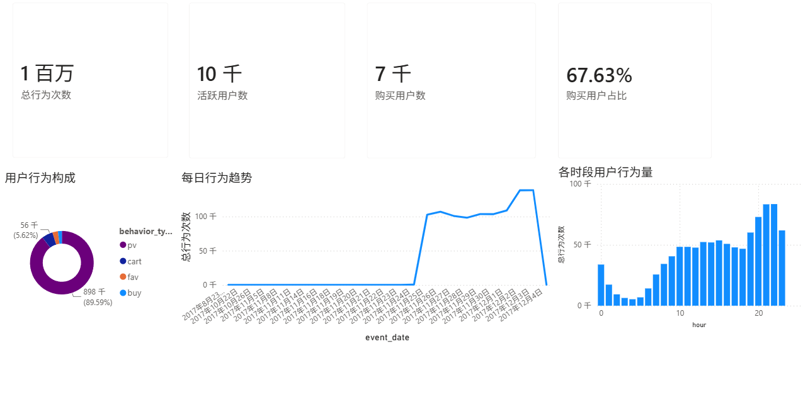
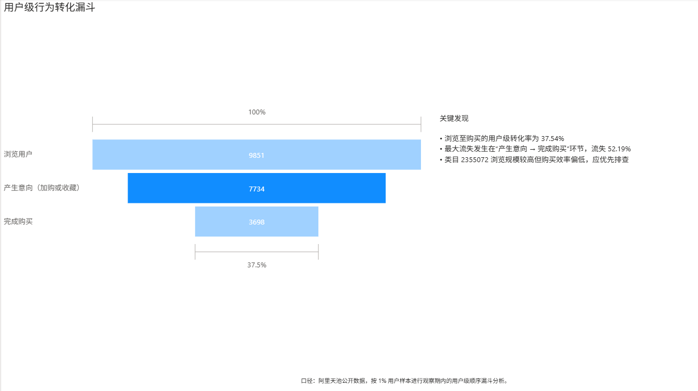
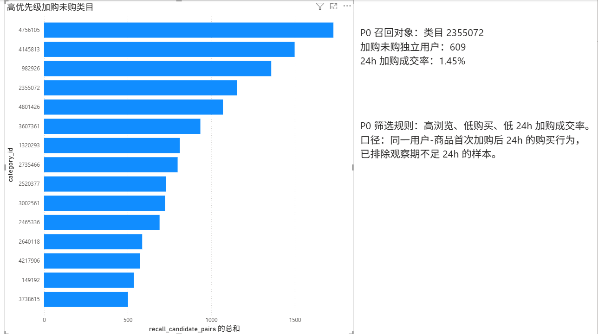

# 淘宝用户加购转化与召回策略诊断

## 项目背景

本项目基于阿里天池淘宝用户行为公开数据，围绕“用户加购后为什么没有及时购买”展开分析。项目从用户行为总览、用户级转化漏斗、类目转化表现和加购后 24 小时成交四个层面定位问题，并为高优先级类目设计可验证的召回 A/B 测试方案。

## 业务问题

1. 用户从浏览、加购/收藏到购买的主要流失环节在哪里？
2. 哪些商品类目存在高浏览、低购买问题？
3. 用户加购后 24 小时内的成交率是多少？
4. 哪些类目和用户适合优先进入召回实验？

## 数据来源

- 数据集：阿里天池 UserBehavior 淘宝用户行为数据集
- 原始文件：`UserBehavior.csv`
- 原始数据量：3.41 GB
- 字段：`user_id`、`item_id`、`category_id`、`behavior_type`、`timestamp`
- 行为类型：`pv` 浏览、`cart` 加购、`fav` 收藏、`buy` 购买

由于原始 CSV 体积较大，本仓库不上传原始数据，仅保留处理代码、SQL 分析脚本、Power BI 看板和项目说明。

## 技术栈

- Python、pandas
- MySQL、SQL、Navicat
- Power BI
- PyCharm

## 数据处理流程

1. 使用 pandas 分块读取 3.41 GB 原始 CSV，避免一次性读取导致内存不足。
2. 通过 `user_id % 100 == 0` 抽取约 1% 用户，并保留被抽中用户的完整行为轨迹。
3. 获得 `1,002,393` 条样本行为记录。
4. 校验缺失值、重复值和异常行为类型。
5. 将 Unix 时间戳转换为中国时间，生成 `event_time`、`event_date`、`hour`、`weekday` 字段。
6. 导入 MySQL 后，使用 SQL 完成漏斗、类目转化、24 小时加购成交和召回对象分析。
7. 使用 Power BI 搭建三页业务分析看板。

## 数据质量校验

| 检查项 | 结果 |
|---|---:|
| 样本行为记录数 | 1,002,393 |
| 缺失值 | 0 |
| 完全重复行 | 0 |
| 异常行为类型 | 0 |

行为分布：

| 行为类型 | 行为次数 | 占比 |
|---|---:|---:|
| 浏览 `pv` | 898,001 | 89.59% |
| 加购 `cart` | 56,377 | 5.62% |
| 收藏 `fav` | 28,029 | 2.80% |
| 购买 `buy` | 19,986 | 1.99% |

## 核心分析结论

### 1. 用户级转化漏斗

漏斗口径：同一用户首次浏览后，首次产生意向（加购或收藏），再完成首次购买；要求行为时间顺序满足“浏览 → 意向 → 购买”。

| 阶段 | 用户数 | 相对上一环节转化率 | 整体转化率 |
|---|---:|---:|---:|
| 浏览用户 | 9,851 | 100.00% | 100.00% |
| 产生意向（加购或收藏） | 7,734 | 78.51% | 78.51% |
| 完成购买 | 3,698 | 47.81% | 37.54% |

发现：最大流失发生在“产生意向 → 完成购买”环节，流失率为 `52.19%`。

### 2. 类目转化诊断

重点类目 `2355072` 具有较高浏览规模，但购买表现偏弱：

| 指标 | 结果 |
|---|---:|
| 浏览用户数 | 3,632 |
| 购买用户数 | 83 |
| 每 100 个浏览用户中的购买用户数 | 2.29 |
| 潜在流失用户数 | 3,549 |

### 3. 加购后 24 小时成交诊断

分析口径：

- 粒度：同一用户、同一商品
- 起点：该用户对该商品的首次加购时间
- 成功：首次加购后 24 小时内购买该商品
- 排除数据结束前不足 24 小时的加购行为，避免观察期不足

| 指标 | 结果 |
|---|---:|
| 有效加购用户-商品对 | 47,826 |
| 加购后最终购买对 | 3,092 |
| 加购后 24 小时内购买对 | 1,827 |
| 24 小时加购成交率 | 3.82% |

### 4. P0 召回对象

优先选择类目 `2355072` 作为 P0 召回对象，原因是该类目同时出现高浏览、低购买和低 24 小时加购成交率。

| 指标 | 结果 |
|---|---:|
| 加购用户-商品对 | 1,170 |
| 24 小时内购买对 | 17 |
| 24 小时加购成交率 | 1.45% |
| 加购未购候选对 | 1,153 |
| 独立召回用户数 | 609 |

说明：`1,153` 为用户-商品对数量，不等于独立用户数；对应 `609` 名独立召回用户，平均每名用户关联约 `1.89` 个加购未购商品。

## A/B 测试方案

实验对象：类目 `2355072` 中，加购后 1-24 小时内未购买的独立用户。

分组方式：

- 实验组：发送一次加购提醒或权益信息
- 对照组：不触达

指标设计：

| 类型 | 指标 |
|---|---|
| 主指标 | 24 小时加购成交率 |
| 次指标 | 7 日内购买率 |
| 护栏指标 | 单个增量购买的优惠成本、触达频率、用户负反馈 |

当前 P0 类目仅有 609 名独立候选用户，适合验证策略方向。若需要评估较小幅度的转化提升，应扩大观察周期或合并更多高价值类目。

## Power BI 看板

### 用户行为总览



### 用户级转化漏斗



### 加购召回诊断



## 项目结构

```text
淘宝用户行为漏斗与留存诊断/
├─ raw_data/
│  └─ README.md
├─ sql/
│  ├─ 01_create_database_and_table.sql
│  ├─ 02_overview_metrics.sql
│  ├─ 03_user_funnel.sql
│  ├─ 04_category_conversion.sql
│  └─ 05_cart_24h_recall.sql
├─ dashboard/
│  ├─ taobao_user_behavior_dashboard.pbix
│  └─ cart_recall_by_category.csv
├─ images/
│  ├─ 01_用户行为总览.png
│  ├─ 02_转化漏斗诊断.png
│  └─ 03_加购召回诊断.png
├─ sample_data.py
├─ clean_data.py
├─ requirements.txt
├─ .gitignore
└─ README.md
```

## 运行方式

1. 下载阿里天池 UserBehavior 数据集，将 `UserBehavior.csv` 放入 `raw_data/`。
2. 安装依赖：

```bash
pip install -r requirements.txt
```

3. 抽样并清洗数据：

```bash
python sample_data.py
python clean_data.py
```

4. 将 `raw_data/UserBehavior_clean.csv` 导入 MySQL 的 `user_behavior` 表。
5. 依次执行 `sql/` 目录下的 SQL 脚本。
6. 使用 Power BI 打开 `dashboard/taobao_user_behavior_dashboard.pbix` 查看看板。

## 简历项目描述

```text
淘宝用户加购转化与召回策略诊断项目        项目负责人        2026/07 - 2026/07
• 【背景与目标】基于阿里天池 3.41GB 淘宝用户行为日志，围绕电商场景中“用户加购后未及时成交”的问题，定位转化流失环节，识别可运营召回用户与高优先级类目，为后续精细化运营提供数据依据。
• 【行动】从原始行为日志中按用户保留完整行为轨迹，清洗并沉淀 100.2 万条有效行为数据；构建“浏览-意向-购买”用户级顺序漏斗，并以“用户-商品”为粒度定义首次加购后 24 小时成交口径，排除观察期不足样本，进一步下钻高浏览低成交类目。
• 【成果】发现意向至购买为主要流失环节，浏览至购买转化率为 37.54%，意向至购买转化率为 47.81%，加购后 24 小时成交率仅 3.82%；定位类目 2355072 为 P0 召回对象，圈定 609 名加购未购用户，输出以 24 小时加购成交率为核心指标的 A/B 测试方案，并沉淀 3 页 Power BI 决策看板。
• 技术栈：Python、Pandas、MySQL、SQL、Navicat、Power BI
```

## 项目局限

- 本项目基于公开历史行为日志，无法验证真实触达后的增量效果。
- 召回方案为实验设计，不宣称已经提升转化率。
- 样本为 `user_id % 100 == 0` 的用户级抽样，不代表淘宝平台整体水平。
